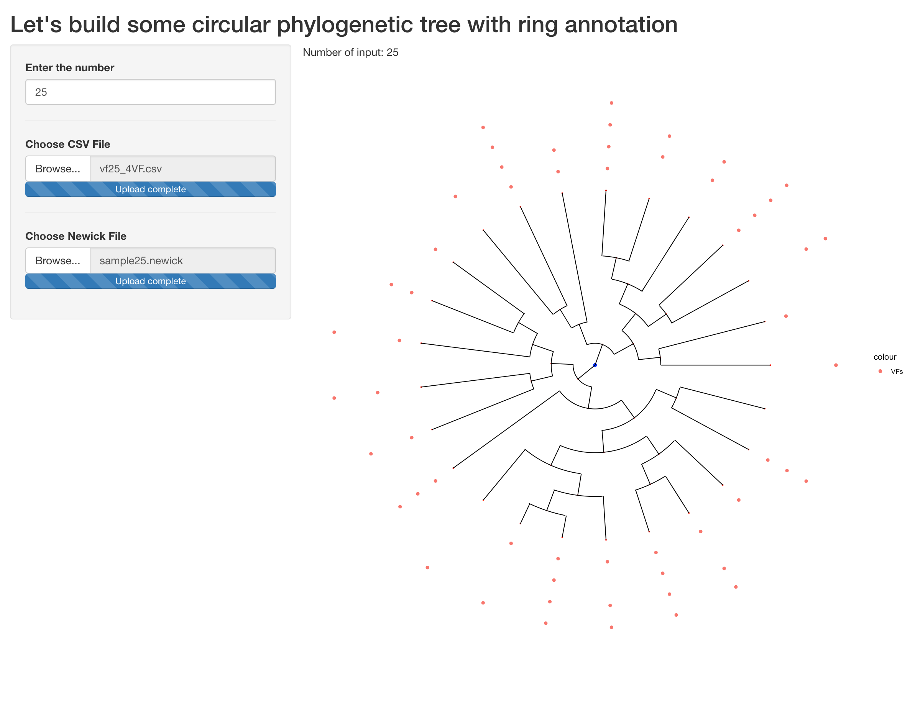
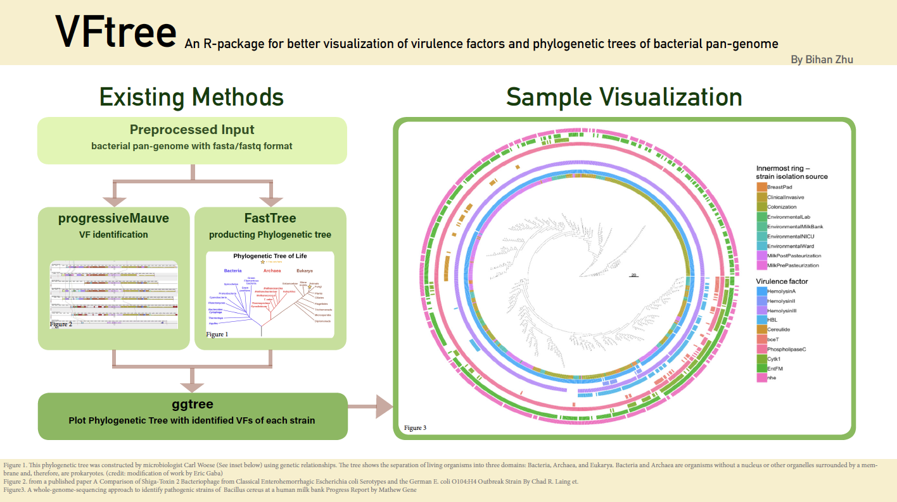
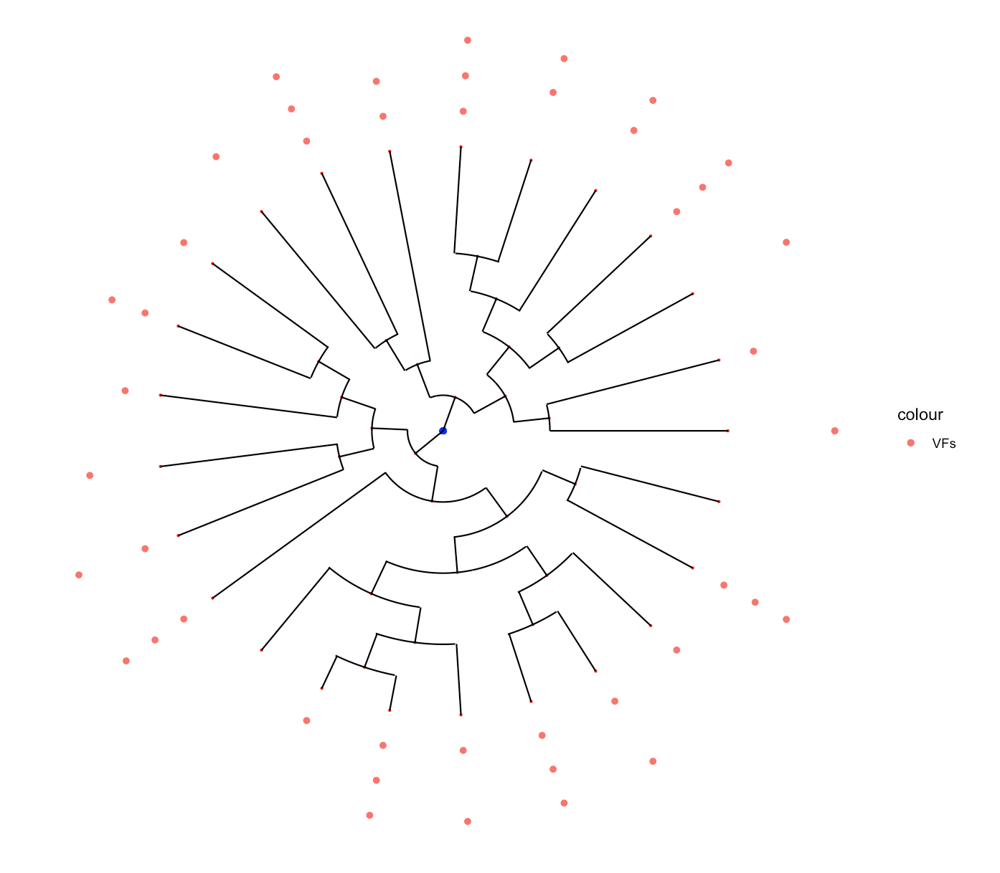
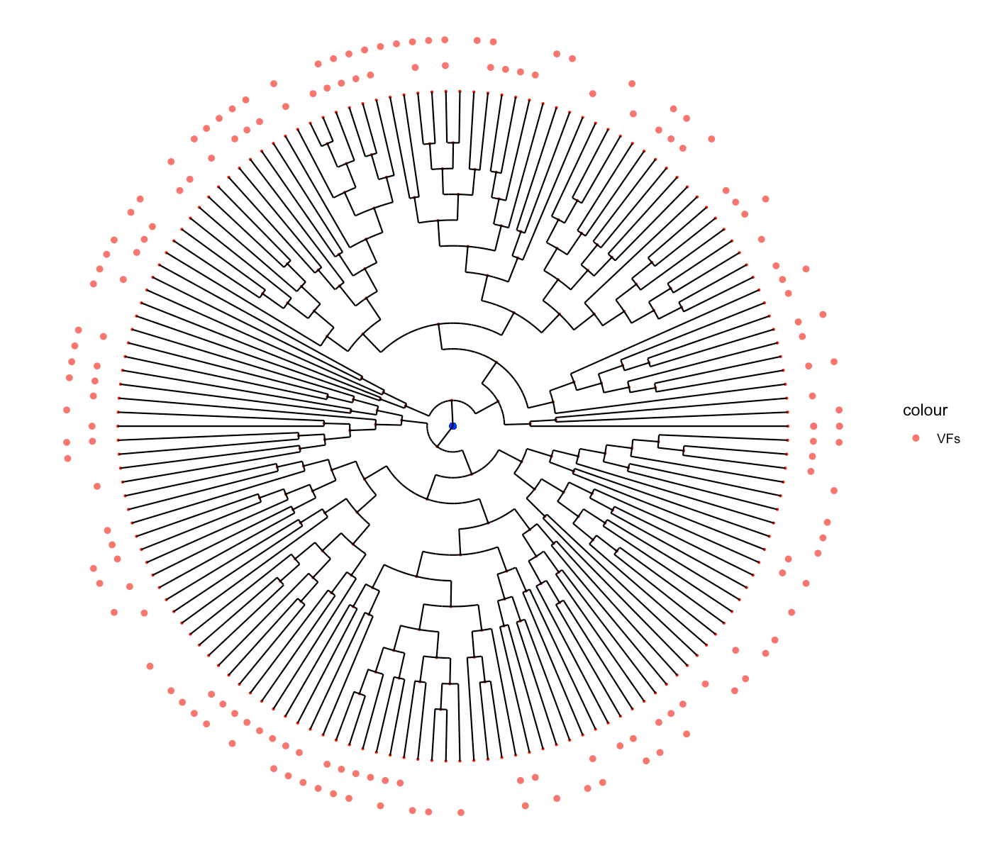

# VFtree

<!-- badges: start -->
<!-- badges: end -->

## Description


An R-package for visualization of Virulence Factors and Phylogenetic Tree of bacterial pan-genome

The goal of VFtree is to build a phylogenetic Tree based on the tree data and the present/absent sheet of the gene/factors to plot a circular prepresentation of the matched information. This package provide a pan-genome approach to easily illustrate the data among strains at the species level.


## Installation


VFtree is currently being hosted on GitHub at https://github.com/Norisama/VFtree
The most up-to-date version of VFtree can be easily installed directly within R, using the devtools package.
You can install the released version of VFtree  GitHub using the following code:


```r
# install devtools, if necessary:
install.packages("devtools", dep=TRUE)
library(devtools)

# install VFtree from github:
install_github("Norisama/VFtree", build_vignettes = TRUE, force=TRUE)
library(VFtree)
```

To run the shinyApp

``` r
runVFtree()
```



## Overview


An overview of the package is ullustrated below.



``` r
browseVignettes("VFtree")
```

This package contains 3 .R file composed of 11 functions to visualize the virulence factors along with the circular phylogenetic tree. THere are three plotting functions avaliable for users.

`combinedPlot()`: The main plotting function to combine the following two parts of the workflow.

`ringPlot()`: This function is used to plot the rings of factoer present/absent of that specific strain mapped in the tree based on the data from the table, the same id name mapped to tree data loop the column of the ring_table_data to plot each ring aroud the tree.

`treePlot()`: This function is used to inital a base tree ploting using ggplot2. This function is composed of two parts: the base tree plotting with only nodes present without any lines/paths and a loop which calling the nodeGroup function to adding data and add a nodeGroup each time by adding a layer of the ggplot.

`runVFtree()`: Is the function that launches the shiny app for this package.

Refer to package vignettes for more details. 


result plot




## Contributions

This is a basic example which shows you how to solve a common problem:

``` r
library("VFtree")
lsf.str("package:VFtree")
```

The author of the package is Bihan Zhu. 

The functions CircularFunc was found on stackoverflow: https://stackoverflow.com/questions/6862742/draw-a-circle-with-ggplot2. Section of the borrowed code is clearly indicated and referenced in the treePlot.R file. Rest of the code was a contribution by Bihan. All sample data are generated by Bihan Zhu.


## References

Silva, A. TestingPackage https://github.com/anjalisilva/TestingPackage
